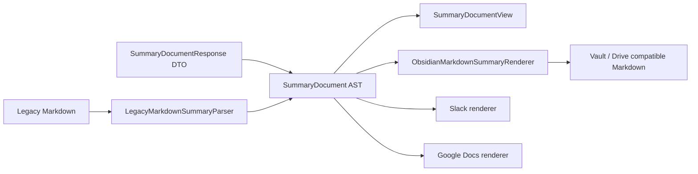

# ADR-0001: SummaryDocument AST をサマリーの正準表現にする

## Status

Accepted

## Date

2026-07-09

## Context

Dahlia のサマリーは、これまで Obsidian Markdown を中心に扱っていた。LLM が `![[screenshot.png]]` や `[[meetingId#HH:MM:SS|label]]` を含む Markdown を生成し、その文字列を `summaries.summary` に保存して、UI 表示、Vault 書き出し、Google Drive エクスポートで再利用していた。

この方式は Obsidian 出力には都合がよい一方、以下の制約がある。

- サマリー本文、画像、文字起こし参照、出力先固有記法が 1 つの Markdown 文字列に混ざる。
- UI は Obsidian 記法を除去・解釈しながら表示する必要がある。
- Slack / Google Docs など、Markdown 以外の出力先では再パースと変換が必要になる。
- Google Docs の部分更新や Slack の分割投稿のように、セクション単位・ブロック単位で扱いたい操作が難しい。
- 既存ユーザーの DB と Vault 出力の互換性は維持する必要がある。

サマリー生成を Obsidian Markdown 直書きから、アプリ内部の構造化ドキュメントへ移すことで、Obsidian を含む各出力先を renderer として扱えるようにする。

## Decision

サマリーの正準表現として `SummaryDocument` AST を導入する。

```swift
struct SummaryDocument: Codable, Equatable {
    var schemaVersion: Int
    var title: String
    var sections: [SummarySection]
    var tags: [String]
    var actionItems: [SummaryActionItem]
}

struct SummarySection: Codable, Equatable, Identifiable {
    var id: UUID
    var heading: String
    var blocks: [SummaryBlock]
}
```

`SummarySection` は書き出し先 API での部分更新や分割投稿を見越し、アプリ側で `UUID.v7()` を採番する。LLM には section id / block id を生成させない。

`SummaryBlock` は enum そのものではなく、共通 metadata を持つ wrapper struct とする。

```swift
struct TranscriptReference: Codable, Equatable {
    var time: String
    var label: String
}

struct SummaryBlock: Codable, Equatable, Identifiable {
    var id: UUID
    var transcriptRefs: [TranscriptReference]
    var content: SummaryBlockContent
}

enum SummaryBlockContent: Equatable {
    case paragraph(String)
    case bulletedList(items: [String])
    case numberedList(items: [String])
    case checklist(items: [ChecklistItem])
    case quote(String)
    case code(language: String, code: String)
    case image(screenshotId: UUID, caption: String)
    case heading(level: Int, text: String)
    case table(headers: [String], rows: [[String]])
}
```

この形にすることで、本文種別とは独立した block-level metadata を増やせる。初期 metadata として `transcriptRefs` を持たせる。

JSON では block 共通 field と content discriminator を同じ object に載せる。

```json
{
  "id": "0197ed9a-....",
  "type": "paragraph",
  "text": "Decision to ship",
  "transcript_refs": [
    {
      "time": "00:10:00",
      "label": "Decision"
    }
  ]
}
```

`SummaryBlock` の Codable は手書きし、未知の `type` は paragraph へフォールバックする。これにより将来の block type 追加時も、古いアプリが完全に読み出せなくなることを避ける。

## LLM Output

LLM からは `SummaryDocumentResponse` DTO を strict JSON Schema で受け取る。

- `anyOf` は使わない。
- block は `type` discriminator を持つ単一 object にする。
- OpenAI 互換 schema と vLLM 系互換実装を考慮し、未使用 field も空文字、空配列、0 として required にする。
- `table` は LLM schema から除外し、必要ならリストで表現させる。
- `transcript_refs` は各 block の required field とし、参照がない場合は `[]` にする。
- 本文中に文字起こし参照リンクは出力させず、構造化フィールドを使う。

DTO はそのまま永続化せず、必ず `SummaryDocument` AST に変換する。この変換で section id / block id 採番、画像 id 検証、空 block の除去、旧記法のサルベージを行う。

## Persistence

DB には `summaries.document` を追加し、`SummaryDocument` を JSON 文字列として保存する。

既存の `summaries.summary` は削除しない。新規生成時も Obsidian 互換の body Markdown を保存し、以下を維持する。

- 既存 DB の可読 fallback。
- Vault / Drive export の現行互換。
- `document` JSON が破損した場合の legacy Markdown fallback。

読み出し時は `document` JSON を優先し、存在しない、または decode できない場合は `summaries.summary` を `LegacyMarkdownSummaryParser` で AST に変換する。

DB migration は列追加のみとし、既存行の一括破壊的変換や schema reset は行わない。

## Rendering

`SummaryDocument` から各出力先への変換は renderer 層に分離する。



Obsidian は正準表現ではなく、renderer の 1 つとして扱う。`ObsidianMarkdownSummaryRenderer` は従来と同型の frontmatter 付き Markdown と body Markdown を出力する。

- image block は `![[<screenshot filename>]]` に変換する。
- `transcript_refs` は `[[meetingId#HH:MM:SS|label]]` に変換する。
- tags / meeting id / title の frontmatter は従来互換を維持する。

UI は Markdown 文字列ではなく `SummaryDocument` を直接描画する。画像 block はインライン画像として表示し、transcript refs は本文から分離された補助情報として表示する。

Slack / Google Docs は今後の renderer 追加先とする。AST が section / block / image / transcript refs を保持するため、出力先ごとに以下のような変換を独立して実装できる。

- Slack: section ごとの Block Kit 配列、画像 attachment、文字起こし参照のリンク化。
- Google Docs: section ごとの batchUpdate、inline image request、見出し・箇条書き・チェックリストへの変換。

## Transcript References

文字起こし参照は本文中 inline link ではなく、block-level の `transcript_refs` に保持する。

```json
"transcript_refs": [
  {
    "time": "00:10:00",
    "label": "Decision"
  }
]
```

理由:

- 本文文字列から app-specific metadata を分離できる。
- renderer が出力先ごとに適切な link 表現へ変換できる。
- 1 block に複数の参照を持てる。
- LLM に特殊 URI の厳密な inline 出力を要求しなくてよい。

Legacy Markdown 互換のため、parser は以下を `transcript_refs` へ抽出する。

- `[[meetingId#HH:MM:SS|label]]`

## Images

画像は `transcript_refs` のような metadata 配列には寄せず、`SummaryBlockContent.image(screenshotId:caption:)` として保持する。

理由:

- 画像は参照 metadata ではなく、サマリー本文の読み順に現れる content である。
- caption と表示位置を block として表現できる。
- UI ではインライン画像、Obsidian では embed、Google Docs では inline image request、Slack では attachment というように、出力先ごとの変換点が明確になる。

## Consequences

良い影響:

- Obsidian 固有記法をアプリ内部の正準表現から分離できる。
- UI、Vault、Slack、Google Docs が同じ AST から派生できる。
- セクション id / block id により、将来の部分更新や出力先同期を設計しやすい。
- 画像と transcript refs が構造化されるため、renderer ごとの変換が明確になる。
- 既存 DB / Vault 出力は `summaries.summary` と Obsidian renderer で互換維持できる。
- legacy Markdown fallback により、既存データと古い custom instruction を吸収できる。

トレードオフ:

- DTO、AST、renderer、legacy parser の中間層が増える。
- `SummaryBlock` の Codable は手書き実装になる。
- list item ごとの transcript 参照ではなく、現時点では list block 全体への参照になる。必要になった場合は item-level metadata を別 ADR で検討する。
- Obsidian 出力では transcript refs を block 末尾に付けるため、旧 inline link と完全に同じ視覚位置にはならない。

## Alternatives Considered

### Obsidian Markdown を正準表現のまま維持する

却下。Obsidian 以外の出力先が常に Markdown 再パースと独自変換に依存し、UI 表示や Docs / Slack 拡張が Obsidian 記法に引きずられる。

### LLM DTO をそのまま永続化する

却下。LLM schema は互換性のために未使用 field を required にするなど、永続モデルとしては冗長である。アプリ側で id 採番、画像検証、fallback 耐性を持つ AST に変換して保存する方が扱いやすい。

### transcript 参照を inline link として本文に残す

却下。本文と app-specific metadata が混ざり、renderer と UI の責務が曖昧になる。LLM にも特殊 URI の厳密な出力を要求する必要がある。

### `time` を単数 optional field として block に持たせる

却下。1 block に複数の transcript 参照を持てない。label も同時に保持しづらい。

### `times: [String]` のみを持たせる

却下。時刻だけでは Obsidian link や UI 表示で使う短い label を構造化して保持できない。

### 画像も refs 配列に寄せる

却下。画像は参照 metadata ではなく、本文中に配置される content である。`image` block として保持する方が読み順、caption、出力先ごとの画像処理を表現しやすい。
