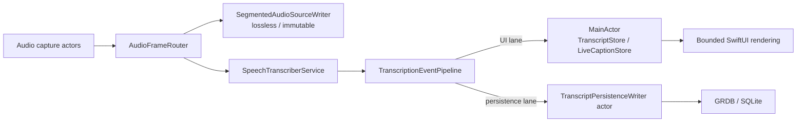

# ADR-0002: 録音クリティカルパスを MainActor から分離する

## Status

Accepted

UI projection の全件保持と停止時 fallback に関する決定は、
[ADR-0006](0006-bounded-transcript-projection.md) により部分的に置き換えられた。

## Date

2026-07-14

## Context

Recavia は録音中にマイクとシステム音声を取得し、リアルタイム文字起こし、字幕表示、SQLite への保存を並行して行う。文字起こし画面やスクリーンショットを含むサマリー画面では、長いリストのレイアウト、テキスト選択、画像デコード、スクロールによって MainActor が長時間占有されることがある。

従来は `SpeechTranscriberService` が生成した `TranscriptionEvent` を MainActor の `CaptionViewModel` へ直接渡していた。そのため、描画が停滞すると認識イベントの受け取りも停滞し、確定セグメントの保存まで同じ待ち行列に巻き込まれた。確定セグメントは `TranscriptStore` の変更を Combine で 500 ms debounce して保存していたため、UI 投影が進まなければ永続化も進まない構造だった。

さらに、以下の同期処理も MainActor の応答性を悪化させる要因になっていた。

- CoreAudio HAL のデバイス列挙、デフォルト入力デバイス取得、動作状態問い合わせ。
- EventKit の認可状態確認とイベント取得。
- スクリーンショットの `NSImage` デコードとサマリー内画像の繰り返し生成。
- 長い文字起こし全体の SwiftUI レイアウトと、録音中のテキスト選択。
- バッチ録音の CAF/range ライフサイクルと、録音停止時の SQLite transaction。

Recavia では UI の一時的な停止より録音データの欠落の方が重大である。したがって、描画負荷を録音・認識・永続化へ伝播させず、負荷時には一時表示の鮮度を落としてでも確定データを守る必要がある。

## Decision

録音中の処理を、欠落を許容しないクリティカルパスと、遅延・集約を許容する UI 投影に分離する。

### 認識イベントを 2 レーンへ分配する

`TranscriptionEventPipeline` actor を、認識 runtime と MainActor の間の共通境界とする。

UI lane は次の規則で `CaptionViewModel` へイベントを渡す。

- `finalized`、`translation`、`clearPreview`、`failure` は順序を保ち、捨てない。
- 未確定文の翻訳は `previewTranslation` として確定翻訳から区別し、UI にだけ投影する。
- `preview` は `(sessionId, sourceLabel)` ごとに未配送の最新値だけを保持する。
- 連続して到着済みのイベントは 1 配列にまとめ、MainActor hop をイベントごとに増やさない。
- MainActor が停滞しても、認識 runtime は UI 処理の完了を直接待たず、pipeline actor への enqueue で戻る。

persistence lane は次の規則で `TranscriptPersistenceWriter` actor へイベントを渡す。

- `finalized` と確定 `translation` を unbounded `AsyncStream` で順序どおり保存する。
- preview、表示消去、UI 向け failure は保存しない。
- UI lane とは別の worker とキューを使い、MainActor の描画停滞を待たない。
- 近接する永続化イベントは短い時間窓でまとめ、単一の SQLite transaction にする。
- writer の追跡状態をリセットする操作も同じ stream に置き、それ以前の保存完了後に実行する。
- セッション終了時の `finish()` はストリームを閉じ、両 worker task の完了を直接 await して drain を保証する。

### 永続化経路を 1 本にする

録音中の逐次保存は `TranscriptionEventPipeline` → `TranscriptPersistenceWriter` の経路だけで行う。`TranscriptStore` を Combine で debounce して保存する旧経路は廃止する。

複数の独立した保存経路が同じセグメントを更新すると、遅れて届いた古い UI snapshot が新しい翻訳を `nil` へ巻き戻す可能性がある。保存順序を 1 actor に集約することで、この競合を避ける。

`MeetingPersistenceService.stop()` では、pipeline の drain 後に MainActor 上の最終 store snapshot も同じ `TranscriptPersistenceWriter` に渡す。これは停止直前のイベントや過去バージョンからの呼び出しを補完する防御的フォールバックだが、通常経路と同じ upsert 規則を使う。セッション・meeting の終了処理は `RecordingSessionCompletionWriter` に集約し、リアルタイム停止とバッチ復旧で同じ transaction 実装を使う。

未確定文の翻訳は durable lane に入れない。また、確定翻訳が `nil` の場合は、すでに保存された非 nil 翻訳を消去しない。

録音開始失敗時は pipeline を drain してから persistence を cancel する。既存ミーティングへの追記を取り消す場合は、その録音セッション ID を持つ `transcript_segments` と `recording_sessions` だけを削除し、過去セッションの文字起こしは保持する。

### 録音 runtime を actor で所有する

`RecordingSessionController` actor が capture、recognizer、CAF recorder、batch scheduler の実行リソースを所有する既存方針を維持する。`BatchAudioRecordingSession` も actor とし、CAF/range の prepare、rotation、finish、cancel と関連 DB 書き込みを MainActor から分離する。

`CaptionViewModel` はセッション要求、UI 状態、store へのイベント投影、停止シーケンスの調整だけを担当し、録音 runtime の可変状態を所有しない。

### 同期 OS 問い合わせを MainActor 外へ出す

CoreAudio HAL と EventKit の同期 API は専用 actor を経由する。

- process-wide の `AudioHardwareQueryService.shared` がマイク一覧、デフォルトデバイス、動作状態、HAL listener の登録・解除を直列化する。テストだけは provider を注入した専用 instance を使える。
- 初回 HAL 問い合わせが完了するまでは system default マイクを楽観的に利用可能とみなし、録音開始時には一覧列挙ではなくデフォルト入力 ID だけを再取得する。
- 一時的に空のデバイス一覧が返っても、ユーザーが明示したデバイス選択を system default へ書き換えない。
- デバイス変更監視では、一度取得したデバイス ID を動作状態確認にも再利用し、HAL 列挙を重複させない。
- EventKit の認可状態とイベント取得は `MacCalendarStore` の MainActor 状態更新から分離し、refresh generation が古い完了結果の上書きを防ぐ。キャンセルはエラーとして報告しない。

Apple framework が同期 API しか提供しない場合でも、単に `Task {}` で MainActor の仕事として実行せず、専用 actor または非 MainActor のサービス境界へ置く。

### 表示負荷を有界にする

描画側では、録音品質を守るために以下の負荷制御を行う。

- `ScreenshotImageLoader` actor が画像ロードを直列化し、表示サイズに合わせて縮小デコードしてキャッシュする。
- 拡大オーバーレイは文字の判読性を守るため元解像度を使うが、巨大な decoded image は共有キャッシュへ残さない。
- ImageIO のダウンサンプリング設定と SwiftUI の画像ロード状態機械は共通実装に集約する。
- 画面から消えた画像ロードはキャンセルし、削除時はキャッシュも無効化する。
- 文字起こし表示は全セグメントを常時レイアウトせず、現在位置付近の有界な window を描画する。
- 録音中はテキスト選択を無効にし、AppKit の選択・レイアウトコストを避ける。録音停止後は従来どおり選択可能にする。

表示用データを集約・制限しても、確定セグメントの store と DB レコードは省略しない。

## Invariants

- 音声フレーム、確定文字起こし、翻訳、CAF range は UI の都合で破棄しない。
- preview は一時表示であり、同一セッション・同一音源の未配送値を最新値へ集約できる。
- MainActor は録音 runtime や逐次 DB 保存の所有者にならない。
- セッション停止は capture を止め、recognizer と pipeline を drain し、永続化を確定してから完了とする。
- 追記録音の cancel は当該セッションのデータだけを削除する。
- UI の windowing、画像キャッシュ、選択制限は永続データを変更しない。
- 新しい同期 OS 問い合わせを MainActor へ追加しない。

## Consequences

良い影響:

- スクロールや画像デコードで MainActor が停滞しても、確定文字起こしの SQLite 保存を継続できる。
- preview の高頻度更新が滞留してもメモリ使用量と復帰後の UI 更新量を抑えられる。
- 認識、UI、永続化の backpressure が分離され、録音データ保護の優先順位がコード上で明確になる。
- 保存経路が 1 本になり、古い UI snapshot による翻訳の巻き戻りを防げる。
- バッチ録音、停止 transaction、CoreAudio/EventKit 問い合わせが MainActor を占有しにくくなる。
- 画像と文字起こしの描画量が入力データ総量に対して無制限に増えない。

トレードオフ:

- pipeline、UI worker、persistence worker、writer actor、停止時 completion writer が増え、停止順序の管理が複雑になる。
- UI が長時間停止している間、確定イベントの UI lane は欠落させないためキューに残る。preview だけが集約対象である。
- 録音開始時はデフォルト入力 ID の確認を待つため、HAL 応答が遅い環境では開始操作の完了も遅れる。ただし一覧列挙は待たず、UI thread 自体もブロックしない。
- windowing により、非常に古い文字起こしへ移動する際は表示 window の更新が必要になる。
- 録音中は文字列を直接選択・コピーできない。

## Failure Handling and Observability

- persistence lane の最初のエラーは保持し、`finish()` で呼び出し元へ返す。
- 録音開始・停止時に pipeline の drain または永続化が失敗した場合は Sentry へ context 付きで送る。
- 停止時 transaction が失敗した場合は成功扱いにせず、`MeetingPersistenceStopResult.failure` として UI へ返す。
- 認識 runtime の failure は UI lane にも渡すが、バッチ録音を継続可能な failure とリアルタイム録音を成立させない fatal failure を区別する。

回帰テストでは少なくとも以下を確認する。

- UI sink が停止中でも persistence sink が確定イベントを受け取る。
- UI backlog の preview が音源ごとの最新値へ集約される。
- store への UI 投影を待たず、確定・翻訳イベントが DB へ保存される。
- 追記録音の cancel が当該セッションのセグメントだけを削除する。
- capture、recognizer、batch recorder、pipeline、persistence の停止順序が維持される。

## Alternatives Considered

### MainActor の処理を個別に最適化するだけ

却下。個々の SwiftUI view や画像ロードを高速化しても、将来別の描画負荷が発生すれば認識と保存が再び同じ MainActor の待ち行列に巻き込まれる。録音クリティカルパス自体を構造的に分離する必要がある。

### すべての認識イベントを無制限 FIFO で MainActor へ送る

却下。確定イベントには適するが、高頻度 preview まで保持すると MainActor 復帰後に古い表示を大量に再生し、メモリと描画負荷が増える。preview のみ latest-wins とする。

### すべてのイベントを latest-wins にする

却下。確定セグメントや翻訳を上書きすると録音データが欠落する。集約できるのは一時的な preview だけである。

### TranscriptStore の Combine debounce 保存を併用する

却下。イベント保存と UI snapshot 保存の到着順が競合し、正しく保存済みの翻訳を古い値で上書きできる。通常時の逐次保存はイベント経路へ一本化し、store snapshot は停止 transaction の防御的フォールバックに限定する。

### 画像を元解像度の NSImage として view ごとに生成する

却下。スクロールのたびにデコードとメモリ確保が発生し、サマリー内で同じ画像を複数回参照すると負荷が重複する。表示サイズへの縮小デコードと共有キャッシュを使う。

### 録音中も全文のテキスト選択を維持する

却下。選択可能テキストは長文の AppKit レイアウトコストを増やす。録音中はデータ保護を優先し、停止後に選択機能を戻す。
