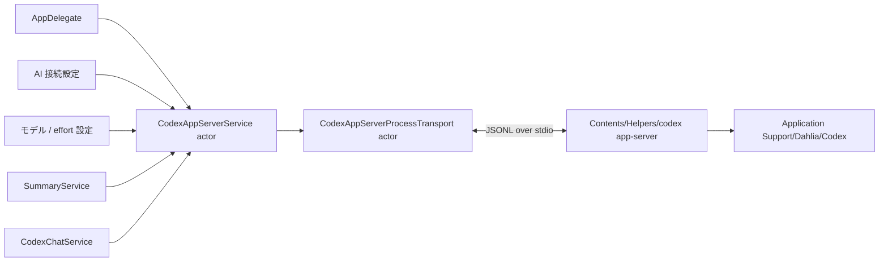
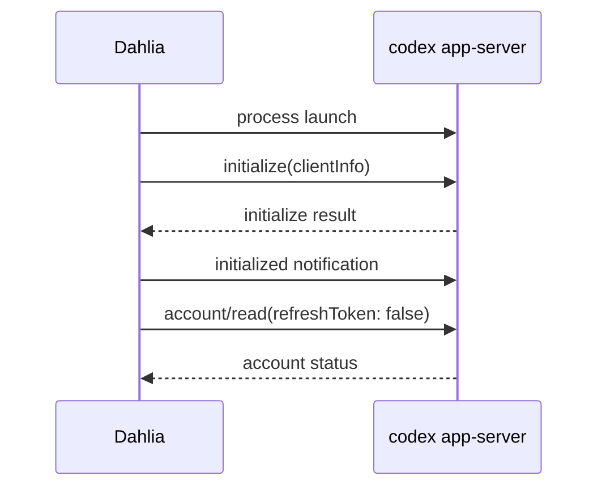
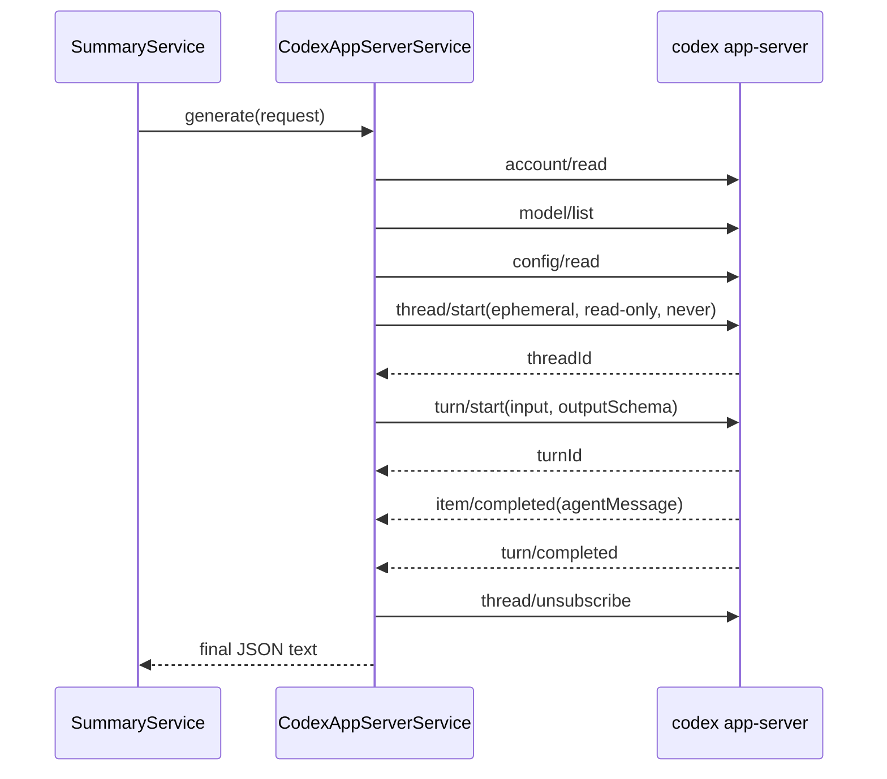

# ADR-0003: Codex app-server をアプリ共有の長寿命 AI バックエンドとして使う

## Status

Accepted

## Date

2026-07-15

## Context

Dahlia の AI 要約は、以前は OpenAI / Databricks の Chat Completions 互換 API をアプリから直接呼び出していた。この方式では provider、endpoint、API token、最大 token 数などを Dahlia が独自に管理する必要があり、認証、モデル一覧、ストリーミング、将来の Codex 機能を利用箇所ごとに実装する構造になっていた。

今後は要約以外でも Codex を利用する予定がある。機能ごとに Codex CLI を起動すると、次の問題が生じる。

- 起動と初期化のコストがリクエストごとに発生する。
- 認証、モデル一覧、通知、approval、キャンセルの実装が重複する。
- 複数の子プロセスが同じ認証状態と設定を同時に扱う。
- プロセス終了、stdout/stderr の drain、アプリ終了時の reap が利用箇所ごとに必要になる。
- 同期的な `FileHandle.read` や `waitUntilExit` を Swift の協調スレッド上で使うと、actor や MainActor が塞がり、モデル一覧などが永久に loading のままになる。

Codex は UI client 向けに `codex app-server` を提供する。app-server は JSON-RPC 2.0 に近い双方向プロトコルを持ち、stdio transport では 1 行 1 JSON message の JSONL を使用する。1 connection ごとに `initialize` request と `initialized` notification が必要で、その後に account、model、thread、turn の request/response と server notification/request が同じ stream 上を流れる。

公式 manual は app-server を、認証、conversation history、approval、streamed agent event を製品へ深く統合するための interface と位置付けている。CI や単発の job automation には Codex SDK を推奨しているため、この ADR の共有 child process は Dahlia の対話的な desktop client に限定する。

app-server protocol は発展中である。Dahlia は外部にインストールされた任意バージョンとの互換性を負わず、固定した OpenAI Codex の公式 GitHub Release `codex-aarch64-apple-darwin.tar.gz` を arm64 native binary として同梱する。release archive の SHA-256 もビルドスクリプトに固定する。展開後は upstream の既存署名を除去し、検証用の ad-hoc 署名で version、Mach-O、arm64 を確認する。app bundle へコピーした後に ad-hoc 署名を除去し、Dahlia と同じ Developer ID と Hardened Runtime で署名する。この ADR は固定版と現在の Dahlia 実装を対象とする。

## Decision

Dahlia process 全体で `CodexAppServerService.shared` actor を 1 instance だけ所有し、同梱した `codex app-server` 子プロセスを長寿命で共有する。



サービスは以下の責務を持つ。

- connection の起動、initialize、停止、再生成。
- request ID による並行 request/response の多重化。
- thread ID / turn ID による notification の関連付け。
- account、login、model catalog の共通 API と cache。
- 要約用 ephemeral thread / turn の開始、完了、interrupt、unsubscribe。
- チャット用 persistent thread の request と streaming notification の多重化。
- server request の安全な拒否と未知 method への JSON-RPC error 応答。
- transport 異常時に全 waiter を有限時間で完了させること。

要約固有の prompt、`SummaryDocumentResponse` schema、文字起こし、画像変換、response decode は `SummaryService` に残す。チャット固有の thread 一覧・復元、schema なし turn、stream event の型変換は `CodexChatService` に置く。transport は業務データを理解せず、両者は同じ connection と dispatcher だけを共有する。

process と時間に依存する境界は protocol に分離する。

- `CodexAppServerTransport`: JSONL 1 行の送受信と close。
- `CodexAppServerLaunching`: child process と transport の生成。
- `CodexExecutableLocating`: app bundle 内 helper の解決。
- `CodexHomeLocating`: 専用 CODEX_HOME の解決と作成。
- `CodexAppServerClock`: request/turn timeout の時間制御。
- `CodexLoginURLOpening`: MainActor 上での browser 起動。

service の lifecycle、timeout、キャンセル、順不同 response は fake transport と fake clock で検証し、実 process test は stdio、signal、reap の境界だけを対象にする。

## Bundled Runtime and CODEX_HOME

実行する binary は常に app bundle の `Contents/Helpers/codex` とし、`PATH` 上の `codex`、Bun/npm package、ユーザーが別途インストールした CLI へは fallback しない。これにより protocol と binary の組み合わせを Dahlia release ごとに固定する。

子プロセスには専用の `CODEX_HOME` を設定する。

```text
~/Library/Application Support/Dahlia/Codex
```

公式 manual では、`CODEX_HOME` は config、auth、logs、sessions、skills、standalone package metadata を含む Codex state の root と定義され、指定先は起動前に存在する必要がある。Dahlia は起動前にディレクトリを作成し、POSIX permission を `0700` にする。`~/.codex` の認証、設定、session をコピー、参照、移行しない。これにより Dahlia と Codex CLI の state ownership を分離する。

同梱する固定版 Codex の account credential store は、専用 config で変更しない限り `file` が既定であり、`CODEX_HOME/auth.json` を使う。要約 thread では MCP OAuth store も `file` に上書きし、MCP credential の Keychain prompt を発生させない。将来、Dahlia 専用 `config.toml` で `cli_auth_credentials_store` または `mcp_oauth_credentials_store` を `keyring` / `auto` に変更した場合は OS credential store を利用し得るため、専用 `CODEX_HOME` だけで Keychain 利用を禁止できるとは扱わない。

Codex helper は V8 の code range を確保するため JIT を必要とする。upstream 署名を除去した後は、helper 専用の `CodexHelper.entitlements` で `com.apple.security.cs.allow-jit` だけを付与し、Hardened Runtime と同時に再署名する。この entitlement を Dahlia 本体や `dahlia-mcp` へ付与しない。download cache の検証と app bundle の最終署名後に entitlement を読み戻し、欠落している build を失敗させる。

### 認証

認証は設定画面から明示的に操作し、ChatGPT Subscription または Databricks を選択する。

ChatGPT Subscription:

1. 起動時と状態更新時に `account/read` を `refreshToken: false` で呼ぶ。
2. 未認証で OpenAI 認証が必要な場合だけ「ChatGPT でサインイン」を表示する。
3. ユーザー操作で `account/login/start` を `type: chatgpt`、`useHostedLoginSuccessPage: true`、`appBrand: codex` として呼ぶ。
4. 返された HTTPS の `authUrl` を `NSWorkspace` で開く。
5. 対応する `account/login/completed` notification を `loginId` で待つ。

Databricks:

1. `databricks auth profiles --skip-validate --output json` から OAuth U2M プロファイルだけを列挙する。
2. 選択したプロファイルの HTTPS workspace host を Databricks AI Gateway の `/ai-gateway/codex/v1` に変換する。
3. Dahlia 専用 `config.toml` に `model_provider = "Databricks"` と Responses wire API を設定する。
4. provider の auth command は `databricks auth token --profile <profile> --output json` の出力から macOS 標準の `plutil` で短期アクセストークンを取得する。Dahlia はトークンを保存しない。
5. 設定変更後は共有 app-server connection を閉じて再初期化し、`model/list` が成功した場合だけ設定完了とする。
6. 成功後に account と model cache を無効化し、`account/read` で表示状態を更新する。

設定変更による connection の再初期化は、進行中の要約 generation が完了して unsubscribe されるまで待機する。account 設定が検証済みの選択と一致しない間は、service 層が通常の `model/list` と generation を拒否し、設定 controller の検証 request だけが明示的にこの guard を迂回する。

ログイン待機 Task のキャンセル、ブラウザを開けなかった場合、ユーザーのキャンセルでは `account/login/cancel` を送る。notification が waiter 登録より先に到着する場合に備え、直近 10 件の login outcome を一時保持する。ログアウトは `account/logout` を明示的に呼ぶ。

起動時の認証エラーは黙って外部 CLI の session へ fallback しない。設定画面または実際の Codex 操作から再試行可能な error として表示する。

## Process Lifecycle

app 起動後に `AppDelegate` が `start()` を非同期に呼ぶ。起動失敗は app 全体の起動を妨げず、AI 接続設定または実際の Codex 操作で表示する。

`start()` は actor 内で直列化し、同時呼び出しは同じ bootstrap の完了を待つ。bootstrap は次の順序で行う。



`initialize` は connection ごとに一度だけ送る。transport 異常後に新しい process を生成した場合は、新しい connection generation として handshake をやり直す。

Dahlia は `initialize.params.capabilities.experimentalApi` を指定せず、固定版の stable API surface だけを使う。Codex version 更新時に experimental field が必要になった場合は、version 固定、schema 差分、fallback behavior を別途判断する。

- `start()` の同時呼び出しは 1 つの bootstrap に合流する。
- launch、initialize、初回 account/read は 15 秒以内に完了しなければ bootstrap 失敗とする。
- bootstrap のキャンセル、timeout、EOF、protocol violation、process exit は接続全体を閉じる。
- connection generation を採番し、古い reader task から遅れて届く failure が新しい接続を停止しないようにする。
- transport の close 完了中に次の start が来た場合は、close を待ってから新しいプロセスを起動する。
- `shutdown()` は恒久的に新規 start を拒否し、終了 cleanup から helper が再生成されないようにする。

アプリ終了時は `NSApplication.TerminateReply.terminateLater` を返し、service の `shutdown()` 完了後に終了を許可する。transport は stdin を閉じて自然終了を待ち、1 秒後も動作中なら SIGTERM、さらに 1 秒後も動作中なら SIGKILL を送り、stdout/stderr と待機中の処理を閉じる。

### stdio transport

wire format は JSON-RPC 2.0 に似た newline-delimited JSON で、wire 上の `jsonrpc: "2.0"` field は省略される。1 行を 1 message とし、stdin/stdout の JSONL と stderr の診断情報を混ぜない。

- stdout は `FileHandle.AsyncBytes.lines` を detached task で継続的に drain する。actor 内や Swift の協調スレッド上で同期 read や process wait を行わない。
- stdin は `DispatchIO` で非同期に書き、各 JSON message の末尾に LF を付ける。write continuation は ID で管理し、close/cancel 時に必ず完了させる。
- stderr は stdout と独立した `DispatchIO` で常時 drain し、pipe の backpressure で app-server を停止させない。
- stderr はユーザー入力を含む完全ログとして保存せず、診断用の末尾 16 KiB だけをメモリに保持する。
- stdout の未消費行は最大 256 行とする。上限超過は message loss を隠さず protocol violation として接続を破棄する。
- stdout queue は read offset を使い、行ごとの `removeFirst()` による O(n) shift を避ける。
- stdout が clean EOF になっても、stderr drain の末尾を短時間待って `processExited` の診断へ含める。

invalid JSON、JSON object でない message、response shape の欠落は protocol violation とする。非 JSON 行を読み飛ばすと request/response の欠落を timeout まで隠すため、fail-fast で全 waiter を完了し、次の操作で接続を再生成する。

### JSON-RPC dispatcher と多重化

client request にはプロセス内で単調増加する整数 ID を割り当てる。`pendingRequests` は request ID から method と continuation へ対応し、response の到着順に依存しない。

受信 message は次の順で分類する。

1. `id` と `method` を持つ server request。
2. 整数 `id` を持つ client request への result/error response。
3. `method` を持ち `id` を持たない notification。
4. どれにも該当しない場合は protocol violation。

キャンセルまたは timeout 済み request の response が遅れて到着することがある。未知の response ID は接続異常にせず無視する。一方、未知の server request は放置せず JSON-RPC `-32601` を返す。

要約と汎用テキストチャットは tool を利用しない設計なので、approval request は次のように fail-closed で処理する。

- command execution と file change approval は `decline` または `denied`。
- permission request は JSON-RPC error `-32000`。
- その他の未対応 server request は `-32601 Client method not supported`。

### timeout とキャンセル

通常 request と接続 lifecycle の失敗半径を分ける。

| 状況 | waiter | 共有プロセス | 次の操作 |
|------|--------|--------------|------------|
| 通常 request の Task cancel | 該当 request だけ `CancellationError` | 維持 | 同じ接続を再利用 |
| 通常 request の 15 秒 timeout | 該当 request だけ `requestTimedOut(method)` | 維持 | 同じ接続を再利用 |
| model/list 画面の cancel | 該当 request と UI loading を解除 | 維持 | 同じ接続を再利用 |
| bootstrap の cancel/timeout | startup waiter を失敗させる | close | 次回 start で再生成 |
| invalid JSON / invalid shape | 全 pending を protocol error で完了 | close | 次回 start で再生成 |
| stdout EOF / process crash | 全 pending を process exit で完了 | close | 次回 start で再生成 |
| 要約 Task cancel | turn waiter を解除し interrupt/cleanup | 維持できれば維持 | 自動再送しない |
| 要約 270 秒 timeout | summary timeout、interrupt/cleanup | 維持できれば維持 | 自動再送しない |

軽量 request の timeout だけで `stopConnection` を呼ばない。共有接続には最大 270 秒の要約 turn が同居するため、`account/read` や `model/list` の timeout が進行中の要約を巻き添えにしてはならない。

transport 異常時は pending request、turn waiter、login waiter、subscriber をすべて同じ error で完了してから stdio を閉じる。要約をプロセスクラッシュ後に自動再送すると、server 側で完了した可能性がある処理を二重実行するため、ユーザー操作による再試行だけを許可する。

### turn notification の多重化

turn の状態は `(threadId, turnId)` を key にし、複数の要約や将来の Codex 操作を順不同で多重化する。

- `turn/start` の response より先に notification が到着する競合に備え、waiter 登録前の message を key ごとに最大 100 件保持する。連続する `item/agentMessage/delta` は item ごとに結合し、小さな delta の集中で先頭が欠落しないようにする。
- `item/completed` のうち `type: agentMessage` の最終 `text` を保持する。
- `turn/completed` の `status` が `completed` なら最終 agent message を返す。空なら `emptyResponse` とする。
- `interrupted` は `turnInterrupted`、`failed` は構造化された認証 error または `turnFailed` に変換する。
- 任意の利用箇所が進行通知を購読できるよう、turn key ごとの `AsyncThrowingStream` subscriber を提供し、turn completion で finish、接続停止では typed error で finish する。completion 自体が購読開始より早い場合も、buffer を再生した直後に finish する。

### 2 つの利用プロファイル

共有 app-server を利用しても、上位 API の出力契約は共通化しない。

| プロファイル | thread | turn output | 完了条件 |
|-------------|--------|-------------|----------|
| AI 要約 | `ephemeral: true` | `outputSchema` 必須の structured output | 最終 agent message を JSON として decode |
| Codex チャット | `ephemeral: false` | `outputSchema` を完全に省略した自由形式 Markdown | delta を逐次表示し、`item/completed` で本文を整合 |

`CodexAppServerRequest` と `generate` は要約専用で、`outputSchema` を non-optional のまま維持する。チャット側はこの request 型や「JSON のみ」を要求する developer instruction を利用しない。

### 要約生成

要約固有の処理は transport から分離し、次の sequence とする。



要約 thread は次の制約を持つ。

- `ephemeral: true`。
- isolated temporary working directory。
- `sandbox: read-only`、`approvalPolicy: never`。
- developer instruction に tool を呼ばず requested JSON だけを返すよう追記。
- apps、hooks、memory、plugins、skills、orchestrator MCP を無効化。
- user config の MCP server を列挙し、thread config 上ですべて無効化。
- structured output schema を `turn/start.outputSchema` に渡す。
- 選択モデルが画像非対応または能力不明なら画像だけを落とし、テキスト要約を継続。

キャンセルまたは要約 timeout では、turn ID が確定済みなら `turn/interrupt` を 1 度だけ送り、その後 `thread/unsubscribe` する。process exit 後の cleanup は新しい接続を起動しない。temporary directory は成功、失敗、キャンセルのいずれでも削除する。

### 汎用テキストチャット

`CodexChatService` は Dahlia 専用の固定作業ディレクトリを `cwd` に使い、Codex rollout を履歴の正本とする。Dahlia DB に会話テーブルは追加しない。

- `thread/start` は `ephemeral: false`、`sandbox: read-only`、`approvalPolicy: never` とする。
- 要約と同じ restricted config で apps、hooks、memory、plugins、skills、MCP、orchestrator を無効化するが、developer instruction と出力契約はチャット専用にする。
- `thread/list` は `sourceKinds: ["vscode"]` と完全一致する `cwd` で絞り、`recency_at` の降順でページングする。同梱する固定版は app-server クライアントの thread を、固有の `originator` を持つこの source kind として保存する。
- `thread/read(includeTurns: true)` で表示履歴を復元し、`thread/resume` で同じ会話を再開する。
- `turn/start` に `outputSchema` を含めず、`item/agentMessage/delta` を逐次配信する。`item/completed` の最終本文で delta の結合結果を置き換える。
- 1 client session につき同時 turn は 1 件に制限する。別 chat session と要約は共有 dispatcher 上で並行できる。
- 停止は `turn/interrupt` を送り、受信済みの部分応答を残す。失敗後の再試行は同じ入力を新しい turn として送る。
- chat の本文、入力、delta は log または Sentry context に含めない。

### model cache と設定

`model/list` は cursor が無くなるまでページングし、hidden model を除外して接続共有 cache に保持する。`account/updated`、login completion、logout、transport reset で account と model cache を無効化する。

保存済み model ID が一覧にあれば再選択する。無ければ表示・実行時だけ server default、次に先頭 model へ fallback し、保存済み ID 自体は上書きしない。model が再度利用可能になれば元の選択へ戻せる。reasoning effort も model catalog が正常に取得できた場合だけ正規化し、失敗や空一覧で保存値を `medium` へ書き換えない。

### エラーの分類とユーザー表示

transport と protocol の内部 error を `CodexAppServerError` へ変換し、呼び出し元が原因別の UI を出せるようにする。

| Error | 意味 | 主な扱い |
|-------|------|----------|
| `helperNotBundled` | app bundle に helper がない | `run-dev.sh` / app build を案内 |
| `launchFailed` | executable、CODEX_HOME、Process 起動失敗 | 再試行可能な起動 error |
| `notLoggedIn` | OpenAI 認証が必要 | 設定画面の明示ログインへ誘導 |
| `loginFailed` | browser login 完了通知が失敗 | 詳細を表示して再試行 |
| `loginPageCouldNotOpen` | auth URL を開けない | ブラウザ起動 error |
| `processExited` | EOF、crash、stdio failure | stderr tail を付け、次回再生成 |
| `requestTimedOut` | method または summary の期限超過 | operation 名付きで再試行を表示 |
| `invalidProtocolResponse` | JSONL/schema/状態遷移の破損 | 接続を破棄し次回再生成 |
| `rpcError` | app-server が返した JSON-RPC error | code/message を保持して表示 |
| `turnFailed` | Codex turn の失敗 | turn error の detail を表示 |
| `turnInterrupted` | server が turn 中断を確定 | 中断として表示 |
| `emptyResponse` | completed だが agent message がない | 要約失敗として再試行 |

`CancellationError` は画面離脱やユーザーキャンセルとして扱い、通常の失敗表示や Sentry 送信を行わない。`notLoggedIn` と `helperNotBundled` も期待される設定状態なので Sentry の障害イベントから除外する。

公式 protocol は request ingress の過負荷を JSON-RPC code `-32001`、`Server overloaded; retry later.` で返し、指数 backoff と jitter を推奨している。Dahlia は任意 method の自動再送を行わず、現時点では `rpcError` としてユーザーへ再試行可能な失敗を返す。method ごとの idempotency を定義した自動 retry を導入する場合は、`account/read` / `model/list` など安全な read request に限定する。

### Privacy と observability

- stdout JSONL の本文、文字起こし、チャット入力・delta、画像 data URI、生成結果をログへ出さない。
- stderr は末尾 16 KiB の診断だけを保持し、永続保存しない。
- Sentry には request/response body を送らない。
- error UI には operation と安全な app-server detail を使うが、prompt や transcript を付けない。
- `CODEX_HOME` は Dahlia 専用かつ `0700` とし、他 Codex client の状態へアクセスしない。

## Invariants

- app 内で共有する app-server process は同時に 1 つだけである。
- `initialize` → `initialized` は接続ごとに 1 度だけである。
- stdout/stderr を継続的に drain し、Swift の協調スレッド上で同期 read/write/wait を行わない。
- 通常 request の cancel/timeout は該当 waiter だけを完了し、健康な共有接続を停止しない。
- transport/protocol failure は全 waiter を完了し、stdio close 後にだけ再起動可能にする。
- request response と turn notification は ID で関連付け、到着順を仮定しない。
- summary cancellation は interrupt と unsubscribe を試みるが、process crash 後に cleanup のためだけの新規 process を起動しない。
- approval と未知の server request へ必ず応答し、server を待ち続けさせない。
- transcript、画像、要約 prompt、チャット本文・delta、生成結果を診断ログや Sentry へ送らない。
- Dahlia は `~/.codex` を利用しない。

## Consequences

良い影響:

- 認証、model cache、JSON-RPC dispatcher、process lifecycle を要約以外の Codex 機能でも再利用できる。
- app-server の起動コストと initialize を操作ごとに繰り返さずに済む。
- 複数の request と turn を順不同で処理でき、モデル画面と要約を同時に利用できる。
- 通常 timeout の失敗半径が小さく、長時間要約を巻き添えにしない。
- blocking stdio と stderr backpressure による永久 loading を避けられる。
- 専用 CODEX_HOME と明示ログインにより、ユーザーが認証先を理解しやすい。
- version 固定により、protocol 変更を release build とテストで管理できる。

トレードオフ:

- actor 内に request、turn、login、subscriber、connection generation の複数の状態機械が必要になる。
- app 起動中は未使用時も子プロセスが存在し得る。
- `~/.codex` の既存ログインを再利用しないため、Dahlia で初回ログインが必要になる。
- Codex version 更新時は release asset と SHA-256、protocol 差分、認証、model shape、notification の回帰確認が必要になる。
- 要約は tool と MCP を無効化するため、将来 tool-assisted summary が必要になった場合は別の安全性判断が必要になる。
- process crash 後に要約を自動再送しないため、ユーザーによる再試行が必要になる。

## Failure Handling and Tests

最低限、次の回帰テストを維持する。

- JSONL の分割受信、複数行同時受信、stdout EOF、stderr backpressure と tail 取得。
- stdout buffer の上限と FIFO 順序。
- 順不同 response、request と notification の混在、未知 response ID。
- invalid JSON、invalid response shape、未知 server request、approval の拒否。
- 1 process の再利用と connection ごとに 1 度だけの initialize。
- model/list の pagination、cache、認証変更時の invalidation。
- 通常 request の cancel/timeout が健康な共有 process と進行中 turn を停止しないこと。
- bootstrap cancel/timeout、EOF、crash 後に stdio を閉じ、次回操作で再起動できること。
- turn notification が response より先に届く場合と、古い generation の message が新しい turn に混入しないこと。
- persistent chat の schema なし turn、delta の早着・結合・最終本文、履歴 cwd/source filter、read/resume。
- 要約の `turn/start.outputSchema` が必須のまま維持されること。
- 要約 cancel/timeout で interrupt と unsubscribe が送られること。
- process exit 後の cleanup と app shutdown 後に新しい helper が起動しないこと。
- browser login の即時 completion、cancel、browser open failure、logout。
- integration test が一時 CODEX_HOME を使い、ユーザーの実 Application Support を変更しないこと。
- app 終了時に長寿命 child が残らないこと。

Codex version を更新する際は、対象 binary の `codex app-server generate-json-schema` または `generate-ts` も使って、利用中 method の request/response/notification shape を固定版間で比較する。生成物はその binary version と一致するため、最新 manual の例だけで固定版の wire shape を推測しない。

## Alternatives Considered

### 要約ごとに `codex exec` または app-server を起動する

却下。毎回 launch と initialize が必要になり、model/account cache を共有できない。キャンセルと process cleanup の競合も操作ごとに重複し、今後の Codex 機能がそれぞれ子プロセスを持つことになる。

### 外部インストール済み Codex を PATH から利用する

却下。ユーザー環境ごとに version と protocol が異なり、Dahlia が検証していない schema 変更を受ける。署名、notarization、ライセンス、arm64 対応も release artifact として保証できない。

### Bun/npm 版 Codex を同梱する

却下。Node/Bun runtime と package tree が追加で必要になる。Apple Silicon 向け公式 native binary を固定して同梱する方が bundle、署名、起動境界を単純にできる。

### Codex を Cargo で source build する

却下。固定 commit、Rust toolchain、Cargo dependency cache を管理できる一方、Codex の workspace 全体を各開発環境でビルドする時間と容量が大きい。公式 Release が同じ固定 version の arm64 native binary と SHA-256 digest を提供しているため、release archive を検証して再署名する方が Dahlia の build を単純かつ高速にできる。

### `~/.codex` の既存認証を共有する

却下。ユーザーの CLI session を透過的に利用し、Keychain access prompt や logout の所有者が曖昧になる。Dahlia 専用 CODEX_HOME と設定画面内の明示ログインを採用する。

### HTTP/WebSocket transport を使う

却下。stdio は同梱した 1 child process とのローカル通信に必要十分で、port 管理、listen address、origin、追加の接続認証が不要である。同梱 version で WebSocket は experimental/unsupported である。

### request timeout ごとに process を再起動する

却下。1 件の遅延が同じ process 上の全 pending request と最大 270 秒の要約 turn を失敗させる。transport の健全性が失われた証拠がない限り、該当 waiter だけを解除する。

### 壊れた stdout 行をログに残して読み飛ばす

却下。stdout は JSONL protocol 専用である。壊れた行が失われた response/notification である可能性を判定できず、読み飛ばすと不整合を timeout まで隠す。protocol violation として connection を再生成する。

### process crash 後に要約を自動再送する

却下。client が completion を受信する前に server 側で処理が完了している可能性があり、二重生成になる。retryable なエラーを返し、ユーザーが明示的に再試行する。

## References

- OpenAI Codex App Server manual: <https://learn.chatgpt.com/docs/app-server.md>
- OpenAI Codex environment variables (`CODEX_HOME`): <https://learn.chatgpt.com/docs/config-file/environment-variables.md>
- OpenAI Codex authentication and credential storage: <https://learn.chatgpt.com/docs/auth.md>
- OpenAI Codex app-server README: <https://github.com/openai/codex/blob/main/codex-rs/app-server/README.md>
- OpenAI Codex app-server protocol source: <https://github.com/openai/codex/tree/main/codex-rs/app-server-protocol>
- `CodexAppServerService`: `Sources/Dahlia/Services/CodexAppServerService.swift`
- stdio transport: `Sources/Dahlia/Services/CodexAppServerProcessTransport.swift`
- Dahlia 専用 CODEX_HOME: `Sources/Dahlia/Services/CodexHome.swift`
