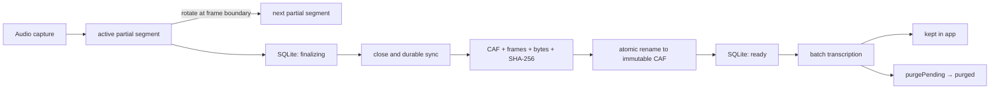

# ADR-0004: 録音データを分割された不変セグメントとして保全する

## Status

Proposed

この ADR は実装方針を定めるものであり、現行実装がすでに以下の保証を満たしていることを示さない。

## Date

2026-07-15

## Context

Dahlia のバッチ録音は、マイクとシステム音声を音源ごとの CAF に追記し、録音中は
`*.partial.caf`、正常終了後は `*.caf` として管理している。音声本体は
`~/Library/Application Support/Dahlia/BatchAudio`、セッション、ファイル、range のメタデータは
SQLite に保存する。

2026-07-15 の障害では、別プロセス等の復旧処理が録音中の `partial.caf` を先に `final.caf` へ移動した後、
録音終了処理が既存の `final.caf` を削除し、存在しない `partial.caf` の移動に失敗した。最初の失敗時に唯一の音声が
失われたため、以後の再処理は `The file doesn't exist.` になった。

[PR #95](https://github.com/mats16/dahlia/pull/95)（コミット `deb269b`、main にマージ済み）は、`partial` / `final` の
存在状態を分け、既存ファイルを無条件に削除せず、最終フレーム数を検証することで、この具体的な損失経路を塞いだ。この修正は
必要な封じ込めだが、次の構造的な問題は残る。

- 通常の二重起動を禁止する製品ポリシーと、Launch Services を経由しない別プロセスを排除する process-wide lock がない。
- 録音中セッションの所有者をプロセス間で判定する lease がなく、DB の `endedAt == nil` だけでは「クラッシュした録音」と
  「別プロセスが現在録音中」を区別できない。
- 1 音源・1 セッションを単一の長時間 CAF にするため、現在のファイルの破損が録音全体へ波及する。
- ファイルシステム操作と SQLite transaction は 1 つの原子的 commit にできないが、不一致を収束させる明示的な状態機械がない。
- `finalizedAt` とフレーム数は保持するが、内容の改変や同じ長さの破損を検出する digest がない。
- 作成完了、復旧、文字起こし完了後の削除、Meeting 削除が別々のサービスからファイルを変更し、破壊操作の入口が分散している。
- `Application Support/Dahlia` と録音ファイルに、Dahlia としての POSIX permission の契約がない。
- 完了した書き込みをストレージへ明示的に同期する耐久化境界がない。

Vault への音声保存機能は廃止予定である。本 ADR は新しい録音を作成から削除までアプリ管理領域だけで管理する設計を対象とし、
既に Vault に保存された音声の移行、互換性、削除は扱わない。

## Decision Drivers

- Dahlia 内の競合、復旧、再試行、削除処理が、完成済みの録音を誤って失わせないこと。
- 異常終了や電源断で破損し得る範囲を、セッション全体ではなく現在書き込み中の短い区間へ限定すること。
- finalization の一時的な遅延だけを理由に録音を中断せず、録音継続を優先すること。
- 音声 callback をファイル同期、hash 計算、DB 書き込みでブロックしないこと。
- SQLite とファイルに一時的不一致が生じても、再起動後に冪等に同じ状態へ収束できること。
- 「文字起こし後に削除」と「アプリ内に保持」というユーザーの保存意図を、録音の lifecycle に一貫して反映すること。
- 新しい外部依存を追加せず、Swift 6.2 strict concurrency と既存 DB を維持すること。

## Scope

本 ADR は録音の完全性と可用性を扱う。

- app-managed storage
- 単一インスタンスとプロセス間排他
- bounded segment と finalization backlog
- durable finalization と integrity metadata
- crash recovery と reconciler
- 文字起こし完了後の保持・削除 lifecycle
- POSIX permission と管理 root 外への誤操作防止

次の機密性・バックアップ施策は、効果と運用コストを実機検証した上で別 ADR で決定する。

- Data Protection class
- FileVault の状態表示とユーザー警告
- backup eligibility / Time Machine exclusion
- App Sandbox
- CAF ごとの app-level encryption

別 ADR で Data Protection class を決める場合も、文字起こし待ちの音声について、画面ロック中の batch transcription と
delete-after-transcription を停止させないことを要件とする。`.completeUnlessOpen` は本 ADR の標準設定には採用しない。

## Threat Model

### 対象にする事象

| 事象 | 方針 |
|------|------|
| Dahlia の crash、強制終了、OS crash、電源断 | 完成済みセグメントを不変にし、active / finalizing の partial だけを復旧対象にする |
| 複数の Dahlia プロセス、旧プロセスの残存、起動時復旧との競合 | 単一インスタンス、process-wide lock、session lease の三層で mutation の所有権を排他する |
| finalization の一時的な遅延 | backlog を bounded に保ちながら rotation を延期し、現在の segment への録音を継続する |
| disk full、permission error、CAF close / rename / DB commit の途中失敗 | 明示的状態機械と再実行可能な遷移で fail closed にする |
| 誤った cleanup、Meeting 削除、再試行処理 | 破壊操作を単一の storage API に集約し、active / ambiguous な音声の削除を拒否する |
| ファイルの切り詰め、同じ長さの内容改変、storage write error | format、frame count、byte count、SHA-256 を検証する |

### 保証しない事象

- ログイン済みの同一ユーザー権限で動く malware、root、管理者による読み取りや削除。
- Finder、Terminal、他アプリからユーザーが直接行った管理領域の変更。
- 別媒体の backup がない状態での SSD 故障、Mac の紛失、ボリューム全体の破損。
- 未確定の active / finalizing セグメントについて、突然の電源断後も 1 frame も失わないこと。
- APFS、SSD、Time Machine、同期サービスに既に複製されたデータの secure erase。

`removeItem` が成功しても、Dahlia は「すべての物理コピーが復元不能になった」とは表示しない。

## Decision

録音ストレージを、短時間の CAF セグメント、不変な完成ファイル、プロセス間 lease、明示的な永続状態機械からなる
単一の `RecordingAudioStore` 境界へ移行する。



### 1. 単一インスタンス、mutation 境界、lease

Dahlia は製品仕様として単一の interactive instance だけを許可し、`Info.plist` に
`LSMultipleInstancesProhibited = true` を設定する。ただし、これは Launch Services を経由しない `swift run`、実行ファイルの直接起動、
異なる build の同時実行に対するデータ完全性の境界とは扱わない
([Apple: App execution](https://developer.apple.com/documentation/bundleresources/app-execution))。

Application Support の Dahlia 管理 root に process-wide `.process.lock` を置き、DB の read-write open、startup recovery、録音開始より前に
non-blocking の排他的 `flock` を取得する。取得できない二つ目の process は録音データと DB を変更せず、既に Dahlia が起動中であることを
通知して終了する。

`RecordingSessionController` actor は引き続き capture と録音 runtime の所有者とする。ファイルの作成、確定、復旧、検証、削除は
`RecordingAudioStore` actor に集約し、Repository、ViewModel、cleanup service が録音 URL を直接削除・置換しない。

各録音セッションの管理ディレクトリにも `.lease` を置き、録音開始時に file descriptor を開いて non-blocking の排他的
`flock` を取得する。process-wide lock は Dahlia 全体の同時 mutation を防ぎ、session lease は crash recovery で個別セッションの所有権を
表現する defense-in-depth とする。

- 録音開始は session lease を取得できなければ失敗し、既存ファイルを変更しない。
- 復旧は session lease を取得できたセッションだけを対象にする。取得できないセッションは「録音中」として無変更で skip する。
- Meeting / Project 削除や一括 cleanup は、active lease のあるセッションを削除せず、呼び出し元へ明示的な error を返す。
- liveness を UUID の時刻、PID、`endedAt`、ファイル更新時刻だけから推測しない。PID と開始時刻は診断 metadata としては使えるが、
  排他の根拠にはしない。
- process 終了時に OS が lock を解放する性質を利用し、期限切れ時刻を使った lock の強制奪取は行わない。

macOS の `flock` は open file に advisory lock を設定し、`LOCK_NB` なら競合時に待たず失敗する
([Apple `flock(2)`](https://developer.apple.com/library/archive/documentation/System/Conceptual/ManPages_iPhoneOS/man2/flock.2.html))。

### 2. 短い不変セグメントと段階的縮退

音源ごとに 60 秒を初期目標とする segment を作る。rotation は capture buffer の frame 境界で行い、先に次の writer を
書き込み可能にしてから、前の writer を callback 外で確定する。finalizer は音源ごとに直列実行し、同一音源の
`F_FULLFSYNC` や hash を並列化しない。

60 秒は通常時の failure domain を小さくする目標であり、録音継続より優先する hard deadline ではない。finalization が遅れた場合は
次の順で縮退する。

1. 通常は active segment 1 本と finalizing segment 1 本までとする。
2. 前 segment の確定が次の rotation までに完了しない場合は、音源ごとに finalizing backlog 2 本までを許容して録音を継続する。
3. backlog が 2 本に達した場合は次の rotation を延期し、現在の active segment を伸長する。backlog が解消したら rotation を再開する。
4. active segment の append が失敗した場合、disk space が安全下限を割った場合、または active segment の時間・byte 数が実装時に定める
   finite safety budget に達した場合だけ、既存の `ready` segment を保全して error stop する。

backlog は本数に加えて、pending byte 数と最古の `finalizationStartedAt` を観測する。safety budget の具体値は fault injection と
対象 Mac での性能測定から rollout 前に定め、設定なし・無制限の状態では有効化しない。異常終了時に未確定になり得る範囲は、
通常時は active と finalizing の最大 2 本、縮退時は active と finalizing backlog の最大 3 本である。active segment は縮退中に
60 秒を超え得るが、finite safety budget を超えて伸長しない。

frame は音源と sample rate に依存するため、session 全体の durability cursor には使わない。録音開始時に、writer の初期化に成功して
録音へ参加する音源を `requiredSources` として永続化し、各音源の progress row を `durableThroughOffsetSeconds = 0`、
`lastContiguousReadySegmentIndex = nil` で同じ transaction 内に作成する。required source は session 終了まで集合から暗黙に除外しない。
開始できなかった予定音源は durability とは別の capture failure として記録・表示する。

各 required source には `durableThroughOffsetSeconds` を持たせ、その音源の session timeline の先頭から segment index 順に途切れず
`ready` になった範囲の終端だけを記録する。後続 segment が先に `ready` になっても、途中の segment が `ready` になるまで cursor を
進めない。session 全体の `fullyDurableThroughOffsetSeconds` は、全 required source の `durableThroughOffsetSeconds` の最小値として導出し、
DB に重複保存しない。microphone-only 等の session では、その session の required source だけを計算対象にする。

縮退開始時は「録音は継続中だが、ディスクへの確定が遅れている」ことを通知する。停止時は、停止理由に加えて
`startedAt + fullyDurableThroughOffsetSeconds` から「どの時刻までは全 required source が保全済みか」をユーザーへ明示し、
単なる file-not-found や一般的な録音失敗として表示しない。音源別の状況が異なる場合は、共通の保全済み時刻と各音源の状態を区別する。

```text
Application Support/Dahlia/BatchAudio/<meeting-id>/<session-id>/
├── .lease
├── microphone-000000-<generation>.partial.caf
├── microphone-000000-<generation>.caf
├── microphone-000001-<generation>.partial.caf
├── system-000000-<generation>.caf
└── ...
```

- segment index と generation ID は DB に先に登録し、ファイル名を再利用しない。
- 作成には一意な path と排他的 create を使う。既存 partial を録音開始時に削除しない。
- `recording_audio_files` は 1 session / 1 source ではなく 1 physical segment を表す。
- unique key は `(recordingSessionId, source, segmentIndex)` とし、generation ID はその segment の一意な物理ファイル名として保持する。
- range は file-local frame と session offset の両方を保持し、segment をまたぐ locale range は segment ごとの range に分割する。
- `ready` になった CAF は不変とする。後から検証に失敗した file は `failed` にし、同じ logical segment の自動修復や上書きを行わない。
  format 変更は将来の新しい segment にだけ適用する。

これにより、復旧不能な partial があっても、それ以前に確定した segment はそのまま文字起こしできる。UI は一部復旧と
欠損区間を区別し、セッション全体を file-not-found だけで破棄しない。

### 3. segment の確定 protocol

各 segment は次の順で確定する。

1. router を次 segment へ切り替え、旧 writer への追加を `seal` して `sealedFrameCount` を確定する。
2. SQLite transaction で segment を `recording` から `finalizing` へ進め、`sealedFrameCount`、partial / final の予定 path、
   `finalizationStartedAt` を永続化する。この transaction が失敗した場合は publish せず partial のまま残す。
3. writer queue を drain し、`AVAudioFile` を close する。
4. file descriptor に `F_FULLFSYNC` を実行する。失敗時は publish せず partial として残す。
5. CAF が読み出せ、sample rate、channel count、`sealedFrameCount` が一致することを検証する。
6. byte count と SHA-256 を計算する。hash はローカル DB にだけ保存し、telemetry へ送らない。
7. 同じディレクトリ内で `partial.caf` を `caf` へ rename する。既存 final の事前削除や in-place 上書きをしない。
8. SQLite transaction で segment を `ready` にし、final path、frame count、byte count、digest、`finalizedAt`、session timeline 上の
   segment 終端を保存する。同じ transaction で、その音源について先頭から連続する `ready` segment を走査し、
   `durableThroughOffsetSeconds` と `lastContiguousReadySegmentIndex` を進める。途中に未確定 segment がある場合は cursor を進めない。

`fsync` だけでは drive cache までの永続化を保証しないため、macOS がより強い順序保証として提供する `F_FULLFSYNC` を segment
境界で使う。これを audio callback や buffer ごとには実行しない
([Apple `fsync(2)`](https://developer.apple.com/library/archive/documentation/System/Conceptual/ManPages_iPhoneOS/man2/fsync.2.html),
[Apple `fcntl(2)`](https://developer.apple.com/library/archive/documentation/System/Conceptual/ManPages_iPhoneOS/man2/fcntl.2.html))。

通常の既存ファイル置換が必要な箇所では、同一 volume 上で data loss を避ける `FileManager.replaceItemAt` を利用できる
([Apple FileManager](https://developer.apple.com/documentation/Foundation/FileManager))。ただし録音 segment の publish は、
不変性を保つため「置換」ではなく一意名への rename を基本にする。

### 4. SQLite とファイルを収束させる状態機械

SQLite transaction は DB 内では atomic だが、CAF の rename や unlink と同じ transaction にはできない。SQLite は crash や
電源断に対する atomic commit を提供する一方、journal / WAL も database state の一部である
([SQLite Atomic Commit](https://www.sqlite.org/atomiccommit.html),
[SQLite File Format](https://www.sqlite.org/fileformat.html))。したがって DB とファイルを同時に更新できたように見せず、途中状態を
永続化して roll forward する。

segment の state は最低限、次を持つ。

| State | 意味 | 許可する操作 |
|-------|------|--------------|
| `recording` | lease 所有者が partial へ書き込み中 | append、rotate、fail |
| `finalizing` | seal 済みで close / sync / verify / publish の途中 | 冪等な確定、fail |
| `ready` | 検証済み immutable CAF を DB が参照 | read、transcribe、retention 遷移 |
| `purgePending` | ユーザー方針または明示削除により削除予定 | unlink の再試行のみ |
| `purged` | app-managed live path で file 不在を確認済み | metadata の監査保持または後日削除 |
| `failed` | 自動選択できない欠損、破損、競合 | 保全、診断、明示的破棄 |

アプリ内に保持する録音は `ready` のまま保持方針と保持期限を別 field に持たせる。`ready` と「永久保持」を同義にしない。

起動時 reconciler は process-wide lock と session lease を取得した後、DB state と directory を照合する。

| DB state | file state | 収束方針 |
|----------|------------|----------|
| `recording` | partial のみ | owner がいなければ seal して `finalizing` へ進め、readable な最終 frame まで復旧する |
| `recording` | final がある | 異常な crash window として final を検証し、`finalizing` を経て `ready` へ進める。選択が曖昧なら `failed` にする |
| `finalizing` | partial のみ | 保存済み `sealedFrameCount` に従って確定 protocol を再開する |
| `finalizing` | final がある | format、frame、byte、digest を検証し、一致すれば `ready` へ進める |
| `ready` | 一致する final | 変更しない |
| `ready` | missing / mismatch | `failed` にし、自動再作成、自動上書き、自動削除を行わない |
| `purgePending` | expected file が残存 | canonical root、generation、expected path を再検証して unlink を再試行し、不在確認後に `purged` へ進める |
| `purgePending` | file がない | `purged` へ進める |
| `purgePending` | path または file の選択が曖昧 | 自動 unlink せず、参照と file を保持して `failed` にする |

- partial と final の両方があり、一方だけが期待 metadata と一致する場合は一致する方を採用するが、他方を同じ処理内で削除しない。
- 両方が valid だが内容が異なる、または metadata だけでは選べない場合は両方を保持して `failed` にし、自動上書き・自動削除しない。
- `purgePending` の unlink が permission error、volume unavailable、その他の再試行可能な理由で失敗した場合は、参照と
  `purgePending` を残し、削除済みとは表示しない。
- DB にない file、path 外 file、未知 generation は orphan として記録するが、age だけを理由に自動削除しない。
- permission error、volume unavailable、Data Protection によるアクセス拒否は、file-not-found や corruption として扱わない。

### 5. アプリ内保持と削除

新しい録音は常にアプリ管理領域に置く。文字起こし後の選択肢が「削除」と「アプリ内に保持」のどちらであっても、任意フォルダへ
移動しない。

- 文字起こしは `ready` segment だけを読み、digest 不一致を検出した場合は処理を止める。
- 文字起こし結果一式と `batchCompletedAt` を同じ SQLite transaction で commit するまでは、元音声を削除しない。
- 「文字起こし後に削除」は、segment を DB transaction で `purgePending` にしてから unlink し、不在確認後に `purged` にする。
- unlink が失敗した場合は参照と `purgePending` を残して再試行し、削除済みとは表示しない。
- 「アプリ内に保持」は `ready` segment を同じ管理領域に残す。retention policy と期限をセッションに保存し、UserDefaults の現在値だけで
  過去データを再分類しない。
- Meeting / Project 削除は、先に対象 audio を tombstone 状態へ移す。file の削除結果を確認する前に cascade で DB 上の唯一の参照を
  失わない。
- 録音中、文字起こし中、state が ambiguous な session の削除は拒否し、stop / cancel / 明示的な破棄を別操作として要求する。
- `try? removeItem` で error を捨てない。個別 file の結果を記録し、部分成功を再実行可能にする。

誤削除に備えた非公開の grace copy は、削除を選んだユーザーの privacy intent と衝突するため既定では作らない。復元猶予を導入する
場合は、保存期間と backup への影響を UI で明示する別 decision とする。

### 6. ローカルファイル境界

管理 root は `0700`、CAF、lease、補助 metadata は `0600` とする。既存の app-managed directory にも起動時に安全に補正する。
relative path は canonical root 配下にあることを destructive operation の直前に再検証し、absolute path、`..`、symlink による
root 外操作を拒否する。POSIX permission は別のローカルユーザーを制限するが、同一ユーザーの process や root を防ぐ境界とは扱わない。

録音内容、full path、digest、音声由来の metadata を Sentry や通常ログへ送らない。診断には state、失敗 stage、source 種別、件数、
redacted ID だけを使う。

## Schema and Migration

登録済み migration は変更せず、実装時の次の migration で segment state と integrity metadata を追加する。

必要な概念 field は次のとおり。

- `segmentIndex`
- `generationId`
- `state`
- `sealedFrameCount`
- segment 単位の `sessionStartOffsetSeconds` と `sessionEndOffsetSeconds`
- `byteCount`
- `sha256`
- `finalizationStartedAt`
- `purgeRequestedAt`
- `purgedAt`
- session 開始時に固定する `requiredSources`
- `(recordingSessionId, source)` 単位の `durableThroughOffsetSeconds` と `lastContiguousReadySegmentIndex`
- session 単位の `audioRetentionPolicy` と必要なら `retentionExpiresAt`

session 単位の frame cursor は作らない。`sealedFrameCount` は物理 segment の検証値とし、音源横断の保全済み位置には使わない。
`fullyDurableThroughOffsetSeconds` は required source の progress から問い合わせ時に導出する。cache が必要になった場合も派生値として扱い、
source progress と別 transaction で更新しない。

既存の app-managed データは破壊的に一括変換しない。

- 既存の managed finalized CAF は 1 本の legacy segment として読み、初回検証時に digest を lazy backfill する。
- 既存の managed partial は session lease を取得できた場合だけ legacy recovery する。
- migration 中に managed source が見つからない、partial と final が異なる、volume が unavailable の場合は DB 参照を消さず、
  移行待ちとして残す。
- `storageLocation == .vault` の行と既存 Vault 音声は本 migration の入力に含めず、移動、書き換え、削除、特別な互換処理を行わない。
  Vault 保存機能の削除は本 ADR の実装範囲外とする。

## Recovery and Durability Objectives

- 正常に `ready` へ到達した segment は、明示的な retention / deletion 遷移なしに Dahlia が変更・削除しない。
- crash / 電源断で同時に未確定になり得る範囲は、通常時は音源ごとに active と finalizing の最大 2 segment、縮退時は
  active と finalizing backlog の最大 3 segment に限定する。
- 60 秒は segment rotation の初期目標であり、厳密な RPO 保証ではない。縮退中の active segment は 60 秒を超え得るが、
  finite safety budget を超えて伸長しない。
- readable な partial は可能な限り最後の valid frame まで回収する。
- data loss や digest mismatch を無視して文字起こし完了にしない。復旧できた区間と欠損区間を UI と診断に明示する。
- finalization の遅延だけでは録音を停止しない。append failure、disk の安全下限、finite safety budget の到達時に停止する。
- 停止時は既存 `ready` segment を保全し、required source の `durableThroughOffsetSeconds` の最小値から導く
  `fullyDurableThroughOffsetSeconds` に基づいて、全 required source で保全済みの区間をユーザーへ通知する。
- app-managed audio の `purged` は live path からの不在だけを意味し、backup、snapshot、同期済み copy の消去を意味しない。

## Rollout

1. PR #95 (`deb269b`) の非破壊 finalization は main にマージ済みで、既知の損失経路を封じ込めた。これを以降の段階的 rollout の
   起点（baseline）とする。
2. 単一インスタンス設定、process-wide lock、`RecordingAudioStore`、session lease、active-session deletion guard を導入し、復旧・削除・
   finalization の mutation を集約する。
3. 新しい DB migration、`recording → finalizing` の永続化 barrier、bounded segment rotation を導入する。既存の managed single-CAF
   reader は互換用に残す。
4. `F_FULLFSYNC`、CAF metadata、byte count、SHA-256 の確定 protocol と startup reconciler を導入する。
5. 段階的縮退、finite safety budget、音源別 `durableThroughOffsetSeconds` とユーザー通知を、fault injection と性能測定で閾値を決めて
   導入する。
6. POSIX permission と canonical-root guard を導入する。
7. crash test と実 process 競合 test が安定した後に、旧 mutation API と legacy managed cleanup を削除する。

各段階は、それ以前の完成済み managed 音声を読める状態で release する。schema reset や既存 managed CAF の一括削除を rollout 手段に
しない。Data Protection、FileVault UI、backup eligibility、App Sandbox、app-level encryption はこの rollout に含めず、別 ADR で扱う。

## Verification

実装時には unit test だけでなく、別 process と実 file system を使う integration test を追加する。

- 通常の二重起動が拒否され、`swift run` と署名済み app 等が競合した場合も process-wide lock を取得できない側が DB と音声を変更しない。
- 録音 process が session lease を保持中は、別 process の recovery と deletion が skip / fail する。
- process kill 後は lease が解放され、完成済み segment を変更せず active / finalizing の partial だけを復旧する。
- `recording → finalizing` commit、close、`F_FULLFSYNC`、rename、`ready` commit の各直前・直後で crash しても、再実行で同じ state に収束する。
- `recording` / `finalizing` / `ready` と、partial only、final only、同一の両方、異なる両方、どちらもない、digest mismatch の matrix を確認する。
- segment rotation 境界で frame の欠落・重複がなく、音源ごとの session offset が連続する。
- finalization が 1 rotation 遅れた場合は backlog を使って録音を継続し、backlog 上限では active segment を伸長し、解消後に rotation を
  再開する。
- 音源ごとの frame count や sample rate が異なっても、`fullyDurableThroughOffsetSeconds` が全 required source の連続した
  `ready` 範囲の最小終端になり、未確定の gap より先へ進まない。単一音源 session は存在する required source だけで計算する。
- active append failure、disk 安全下限、finite safety budget 到達時だけ error stop し、UI が
  `fullyDurableThroughOffsetSeconds` から全 required source で保全済みの時刻を表示する。
- disk full、permission error、write queue overflow、Data Protection の access denial を file-not-found と混同しない。
- batch 結果の DB commit 前には音声を削除しない。`purgePending` の unlink 前後で crash した場合、file が残存すれば再試行し、
  file がなければ `purged` へ進み、path が曖昧なら自動削除しない。
- active / failed / ambiguous session を Meeting、Project、一括削除から消せない。
- root が `0700`、file が `0600` であり、canonical root 外の path と symlink を destructive operation が拒否する。
- legacy managed CAF の migration が、source 不在や中断後もデータ参照を失わない。

## Consequences

良い影響:

- 1 つの競合や current file の破損が、長時間の録音全体を失わせにくくなる。
- finalization の一時的な遅延で会議途中の録音を直ちに停止しない。
- 完成済み segment は immutable なので、復旧、再試行、文字起こし、削除の責務が明確になる。
- DB と file system の不一致が隠れた例外ではなく、観測・再実行可能な state になる。
- frame count に加え digest で silent corruption を検出できる。
- removable volume、network、同期 provider の可用性と競合を録音 critical path から外せる。

トレードオフ:

- file 数、DB row 数、rotation と reconciliation の実装量が増える。
- segment 境界で close、sync、hash の I/O が発生するため、callback 外の bounded queue と性能測定が必要になる。
- finalization 遅延中は active segment が通常目標より長くなり、crash 時の潜在的な損失範囲が一時的に広がる。
- safety budget 到達後はローカルだけで録音を無期限に継続できず、最終手段として停止が必要になる。
- range が segment をまたぐため、batch request と timeline の組み立てが複雑になる。
- app-managed audio を削除しても、Time Machine、APFS snapshot、同期サービス等が削除前に作成した copy は残存し得る。
- アプリ管理領域だけでは volume failure に対する冗長性を提供できない。
- legacy managed single-CAF の互換 reader / migration を移行期間中は維持する必要がある。

## Alternatives Considered

### finalization が rotation deadline を超えた時点で録音を停止する

却下。完成済み segment の破損範囲は厳しく制限できるが、一時的な disk stall や sync 遅延によって会議の残りすべてを録音できなくなる。
bounded backlog、rotation 延期、active segment の finite safety budget を使い、停止は active write または有限な資源上限に達した場合の
最終手段とする。

### 単一 CAF のまま、`replaceItemAt` とフレーム数検証だけを強化する

却下。PR #95 の封じ込めとしては正しいが、active session の所有権、長時間 file の failure domain、耐久化、digest、DB / file の
状態遷移を解決しない。

### 録音開始時に second copy へ同時書き込みする

却下。同じ process、同じ code path、同じ volume への二重書き込みは crash、disk full、volume failure に対して独立した冗長性にならず、
callback と disk I/O の負荷だけを増やす。短い immutable segment と外部 backup の責務分離を優先する。

### 音声を SQLite BLOB に保存する

却下。大容量 streaming audio を DB transaction、WAL / journal、backup、vacuum の failure domain に取り込み、DB と音声の障害を分離できない。
SQLite は metadata と state machine の正本、CAF は immutable payload とする。

### 録音中の CAF を user-selected folder へ直接書く

却下。方針として新しい録音はアプリ内管理へ統一する。また removable volume、network / file provider、同期競合、権限失効を録音 critical path に
持ち込むことになる。

### `LSMultipleInstancesProhibited` だけで多重起動を防ぐ

却下。通常の起動 UX には利用するが、Launch Services を経由しない executable、異なる build、旧 process の残存をデータ完全性の境界として
排除できない。process-wide lock と session lease を併用する。

### `NSFileCoordinator` だけで process 競合を解決する

却下。`NSFileCoordinator` は協調する file presenter 間の操作調整には有効だが、録音セッションの liveness、crash 後の lock 解放、
DB state、durability を表さない。process-wide lock、session lease、state machine の代替にはしない。

### transient audio に `.completeUnlessOpen` を標準適用する

本 ADR では採用しない。close 済み segment の batch transcription が画面 unlock まで滞留し、その結果 delete-after-transcription も遅れて、
ユーザーが削除を選んだ音声を想定より長く残す可能性がある。ロック中にも処理できる保護方式の効果と挙動を実機で測り、別 ADR で決定する
([Apple: `completeUnlessOpen`](https://developer.apple.com/documentation/foundation/fileprotectiontype/completeunlessopen),
[Apple: `completeUntilFirstUserAuthentication`](https://developer.apple.com/documentation/foundation/fileprotectiontype/completeuntilfirstuserauthentication))。

### 自動削除前に非公開の recovery copy を一定期間残す

既定方針として却下。誤削除からの復元性は上がるが、「文字起こし後に削除」という privacy intent に反する。導入するなら明示的な
opt-in と保存期限を持つ別 decision にする。

## References

- [Apple: Application Support の用途](https://developer.apple.com/library/archive/documentation/FileManagement/Conceptual/FileSystemProgrammingGuide/MacOSXDirectories/MacOSXDirectories.html)
- [Apple: App execution](https://developer.apple.com/documentation/bundleresources/app-execution)
- [Apple: `flock(2)`](https://developer.apple.com/library/archive/documentation/System/Conceptual/ManPages_iPhoneOS/man2/flock.2.html)
- [Apple: `fsync(2)` と `F_FULLFSYNC`](https://developer.apple.com/library/archive/documentation/System/Conceptual/ManPages_iPhoneOS/man2/fsync.2.html)
- [Apple: FileManager](https://developer.apple.com/documentation/Foundation/FileManager)
- [Apple: File Protection](https://developer.apple.com/documentation/foundation/fileprotectiontype)
- [SQLite: Atomic Commit](https://www.sqlite.org/atomiccommit.html)
- [SQLite: Database File Format](https://www.sqlite.org/fileformat.html)
