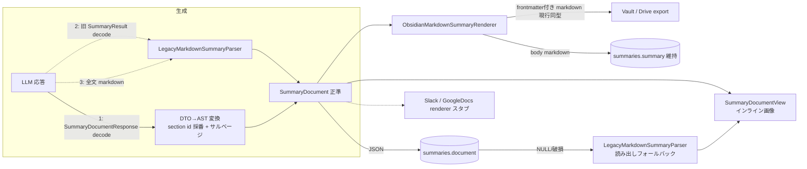

# サマリーの構造化(セクション + ブロック AST + 画像)

## Context

サマリーの書き出し先として Obsidian に加え Slack 投稿・Google Docs(標準 API 経由、画像対応)を 1st tier でサポートしたい。現在サマリーは Obsidian 記法前提の markdown 文字列(`![[file]]` 画像埋め込み、`[[id#HH:MM:SS]]` リンク)として LLM が生成し、`summaries.summary`(notNull)にそのまま保存され、UI 表示(`sanitizedMeetingSummary` で記法除去)・Vault 書き出し・Drive エクスポート(markdown→Docs、画像非対応)がこの文字列を消費している。

書き出し実装の前段として、サマリーを **LLM が直接生成するセクション + ブロック AST**(`SummaryDocument`)として生成・永続化・管理するよう再構成する(ユーザー決定事項)。加えて:

- **セクションを識別できる構造にする**(Google Docs 等でセクション単位の API 操作をするため)。画像はセクションの blocks 内に位置情報ごと保持。
- サマリータブでスクリーンショットを**インライン画像表示**する(現在は除去してテキストのみ)。
- Slack / Google Docs レンダラ自体はスコープ外(インターフェースのスタブのみ)。Vault 書き出し・Drive エクスポートは**現行出力と同型を維持**。

## データフローの変化



## 正準モデル(新規 `Sources/Dahlia/Models/SummaryDocument.swift`)

```swift
/// 会議サマリーの正準表現。summaries.document に JSON で永続化。
struct SummaryDocument: Codable, Equatable, Sendable {
    var schemaVersion: Int = 1
    var title: String
    var sections: [SummarySection]
    var tags: [String]
    var actionItems: [SummaryActionItem]
}

/// 書き出し先 API でセクション単位の操作(Docs の部分更新、Slack の分割投稿等)を
/// 可能にするための識別可能な単位。
struct SummarySection: Codable, Equatable, Sendable, Identifiable {
    var id: UUID              // アプリ側で UUID.v7() 採番(LLM には生成させない)
    var heading: String       // セクション見出し(空可 = 見出しなし先頭セクション)
    var blocks: [SummaryBlock]
}

struct TranscriptReference: Codable, Equatable, Sendable {
    var time: String      // HH:MM:SS
    var label: String     // UI/renderer 用の短いラベル。空なら time を使う
}

struct SummaryBlock: Codable, Equatable, Sendable, Identifiable {
    var id: UUID                // アプリ側で UUID.v7() 採番
    var transcriptRefs: [TranscriptReference]
    var content: SummaryBlockContent
}

enum SummaryBlockContent: Equatable, Sendable {
    case paragraph(String)                          // インライン markdown(bold/link 可)
    case bulletedList(items: [String])
    case numberedList(items: [String])
    case checklist(items: [ChecklistItem])
    case quote(String)
    case code(language: String, code: String)
    case image(screenshotId: UUID, caption: String) // screenshots テーブル参照
    case heading(level: Int, text: String)          // セクション内の小見出し(level 3 相当)
    case table(headers: [String], rows: [[String]]) // レガシー markdown 変換専用。LLM スキーマ外

    struct ChecklistItem: Codable, Equatable, Sendable {
        var text: String
        var checked: Bool
    }
}
```

- `SummaryBlock` の Codable は `{"id": "...", "transcript_refs": [...], "type": "...", ...}` の keyed encoding を手書き。**未知 type は `.paragraph(text)` にフォールバック**(前方互換、throw しない)。
- transcript 参照は本文中のゆるい inline link ではなく、block-level の `transcript_refs: [{ "time": "HH:MM:SS", "label": "..." }]` に保持する。各レンダラが変換(Obsidian → `[[meetingId#HH:MM:SS|label]]`、UI 表示 → block の補助情報として表示)。
- `SummaryActionItem`(既存 `Models/SummaryActionItem.swift`、Codable+Equatable)をそのまま利用(internal struct なので Sendable は推論される)。

## LLM 出力(新規 `Sources/Dahlia/Models/SummaryDocumentResponse.swift`)

現行 `Models/SummaryResult.swift` の置き換え。strict JSON Schema(OpenAI 互換)の制約から:

- **anyOf は使わない**。ブロックは単一 object + `type` enum discriminator + 全フィールド required(未使用は空文字/空配列/0)。vLLM 等の互換実装との互換性優先。
- ネストは sections → blocks → items の固定 3 階層のみ、再帰なし。
- table は LLM スキーマから除外(プロンプトで「表はリストで表現」と指示)。

```swift
struct SummaryDocumentResponse: Decodable {
    let title: String
    let sections: [SectionDTO]
    let tags: [String]
    let actionItems: [SummaryActionItem]        // CodingKey: action_items

    struct SectionDTO: Decodable {
        let heading: String
        let blocks: [BlockDTO]
    }
    struct BlockDTO: Decodable {
        let type: String      // "paragraph"|"bulleted_list"|"numbered_list"|"checklist"|"quote"|"code"|"image"|"heading"
        let level: Int        // heading 用(それ以外 0)
        let text: String      // paragraph/quote/heading 本文、code 中身、image caption
        let items: [ItemDTO]  // list/checklist 用(それ以外 [])
        let transcriptRefs: [TranscriptReferenceDTO] // CodingKey: transcript_refs
        let language: String  // code 用
        let imageId: String   // image 用: 提供された <image_id> UUID(CodingKey: image_id)
    }
    struct ItemDTO: Decodable { let text: String; let checked: Bool }
    struct TranscriptReferenceDTO: Decodable { let time: String; let label: String }

    static let responseFormat: LLMService.ResponseFormat
    // 現行 SummaryResult.responseFormat と同じ JSONSerialization + schemaData 方式、strict: true
    // (LLMService.ResponseFormat / JSONSchemaSpec は変更不要)
}
```

**DTO → SummaryDocument 変換**(SummaryService 内):

- セクションごとに `UUID.v7()` を採番。
- `image` は `UUID(uuidString: imageId)` が当該 meeting の screenshots に存在するもののみ採用。不一致は caption を paragraph 化 or 破棄(現行 `normalizeScreenshotEmbeds` の防御と同思想)。
- 全テキストに**旧記法サルベージ**: `![[...]]` → 対応 screenshot があれば image ブロック昇格(stem が UUID のため照合可能 — `ScreenshotExportService.filename(for:)` は `<UUID>.<ext>`)、`[[id#HH:MM:SS|label]]` → block-level の `transcript_refs` へ抽出(カスタム instruction に旧プロンプト全文を保存しているユーザー対策)。

**フォールバック連鎖**(structured output 非対応/パース失敗時):

1. `SummaryDocumentResponse` デコード → 変換
2. 失敗 → 旧 `SummaryResult` 形式(title/summary/tags/action_items)でデコード → summary markdown を `LegacyMarkdownSummaryParser` でセクション/ブロック化
3. 失敗 → 応答全文を markdown としてパース(title 空。現行の同フォールバックと同挙動)

## プロンプト変更(`Sources/Dahlia/Models/AppSettings.swift` L382 付近)

- `summaryPromptPreamble` の `<output_policy>`(L388-397)の "Use Markdown." → 構造化ブロック生成の説明(インラインは markdown 可)に差し替え。
- `<rendering_rules>`(L405-416): transcript 参照は本文中リンクではなく各 block の `transcript_refs` に `{"time":"HH:MM:SS","label":"short label"}` として入れる(現行 `([[<transcript_id>#HH:MM:SS|HH:MM:SS]])` を置換)、スクリーンショットは `image` ブロック + 提供 `<image_id>` UUID(現行 `![[<image_filename>]]` を置換)、表はリストで表現、に差し替え。
- `SummaryService.generateSummary` 内のローカル定数 `structuredInstruction`(SummaryService.swift L42-57、カスタム instruction 時も常に system 末尾に付与される)を sections/blocks の JSON 構造説明に更新。
- `SummaryService.screenshotMetadata`(L147-160): `<image_id>` を **screenshot UUID(拡張子なし)** に変更。`<image_filename>` は現行のまま残す — 旧指示に従った `![[<filename>]]` 出力も stem=UUID でサルベージ可能。
- `defaultOutputFormat`(L420)/ `customerMeetingOutputFormat`(L433)は「各見出し = 1 セクション」となる旨を追記する程度でほぼ維持。

## 永続化

- **マイグレーション `v9_summaryDocument`**(`Database/AppDatabaseManager.swift` L64 の `return migrator` 直前に追加のみ・既存 v3-v8 不変更): `summaries` に `document TEXT` を既存の冪等ヘルパー `addColumnIfNeeded(in:table:column:type:)`(L294)で追加。バックフィルなし。
- **`Database/SummaryRecord.swift`**: `var document: String?` 追加。`summary` カラム(notNull)は**維持し、新規行には frontmatter 抜きの Obsidian 互換 body markdown を書く**(Drive エクスポート互換・JSON 破損時の可読フォールバック)。`title` カラムも現行どおり維持。
- **読み出しフォールバック** `SummaryRecord.loadDocument() -> SummaryDocument`: document JSON デコード、NULL/破損時は `LegacyMarkdownSummaryParser.parse(markdown: summary, title: title)`。
- **`Database/MeetingRepository.swift`**: `applyGeneratedSummary(toMeetingId:title:summary:tags:)`(L311)→ `applyGeneratedSummary(toMeetingId:document:renderedBody:tags:)` に変更。title は `document.title` から取得し、**空なら既存 title を保持する現行ロジック(L321-324)を維持**。document は `JSONEncoder` + `.sortedKeys` でエンコードして保存。`fetchMeetingDetail` の `MeetingDetail.summary: SummaryRecord?` はそのまま(呼び出し側が `loadDocument()` を使う)。
- `SidebarViewModel` の `EXISTS(SELECT 1 FROM summaries ...)` による `hasSummary` 監視(SidebarViewModel.swift L169)は無変更で動く。

## レンダリング層(新規 `Sources/Dahlia/Services/SummaryRendering/`)

- `SummaryRenderContext`: `{meetingId, createdAt, screenshots: [MeetingScreenshotRecord]}`(screenshotId → ファイル名解決用)。
- **`LegacyMarkdownSummaryParser.swift`**: markdown → sections/blocks。`MarkdownContentView.parseBlocks`(Views/MarkdownContentView.swift L160-273)のロジックを移植・拡張:
  - 追加: checklist(`- [ ]` / `- [x]`)、`![[...]]` → image(context の screenshots と stem-UUID 照合)、`[[id#HH:MM:SS|label]]` → block-level `transcript_refs` へ抽出、frontmatter スキップ、heading レベル 1-2 でセクション分割(最初の heading より前は heading 空のセクション)。
  - 既存の table / horizontalRule / code / quote / list パースは維持(table は `.table` ブロックへ、hr は段落区切り扱いで破棄可)。
  - フォールバック 3 か所(LLM 応答フォールバック・レガシー DB 行・旧記法サルベージ)から共用。
- **`ObsidianMarkdownSummaryRenderer.swift`**: `render(document, context) -> (fileName, markdown /* frontmatter 付き */, body)`。現 `SummaryService` から移設: frontmatter 組み立て(L107-126、title エスケープ・tags YAML 含む)、`summaryFileName`(L298-308)。image → `![[<ScreenshotExportService.filename(for:)>]]`、`transcript_refs` → `[[meetingId#HH:MM:SS|label]]`。**現行 Vault 出力と同型**を維持(`findSummaryFile` の frontmatter 先頭 512 バイト内 meeting_id 照合・`VaultSummaryExportService.resolveSummaryFileURL` の upsert・Drive upsert と互換)。
- **`SlackSummaryRenderer.swift` / `GoogleDocsSummaryRenderer.swift`(スタブ)**: 型宣言 + TODO のみ。セクション id ベースで部分更新できる Output 形(Docs: セクションごとの batchUpdate リクエスト群 + inline image 参照、Slack: セクションごとの Block Kit 配列)をコメントで明示。

## UI(インライン画像表示)

- 新規 `Views/SummaryDocumentView.swift`: `SummaryDocument` の sections/blocks を直接描画。`MarkdownContentView` の block→View 変換(headingView/tableView/inlineMarkdownText 等)を移植し、**`MarkdownContentView.swift` は削除**(消費者は ControlPanelView L575 の 1 箇所のみ、確認済み)。
- image ブロック: `imageProvider: (UUID) -> NSImage?` で `CaptionViewModel.screenshots`(@Published、BLOB は既にメモリ上)から解決。`@State` の `[UUID: NSImage]` キャッシュで 1 回だけデコード、`LazyVStack`、`scaledToFit` + 最大高さ制限。ロード失敗プレースホルダ文言は `L10n` に computed property 追加 + `ja.lproj`/`en.lproj` 両方の Localizable.strings にキー追加。
- checklist ブロック描画(SF Symbol `checkmark.square` / `square`)を追加。`transcript_refs` は本文から分離し、block の補助情報として時刻を表示する。
- `ViewModels/CaptionViewModel.swift`:
  - `currentMeetingSummary: String?`(L89)→ `currentSummaryDocument: SummaryDocument?`。`hasCurrentMeetingSummary`(L119)は document の sections 非空判定に変更。`sanitizedMeetingSummary`(L133)は削除。
  - `LoadedMeetingData.summary: String?`(L393)→ `summaryDocument: SummaryDocument?`(`fetchLoadedMeetingData` L399 で `detail.summary?.loadDocument()`)。`applyLoadedMeetingData`(L701)と `resetSummaryState`(L738)も追随。
- `Views/ControlPanelView.swift` summaryTabContent(L548-589): `MarkdownContentView(markdown:)` → `SummaryDocumentView(document:imageProvider:)` へ差し替え。

## SummaryService の再構成

```swift
struct GeneratedSummary {
    let document: SummaryDocument   // 正準
    let fileName: String            // Obsidian レンダラ由来(現行 summaryFileName 互換)
    let markdown: String            // frontmatter 付き(Vault/Drive 用、現行互換)
    let renderedBody: String        // summaries.summary 用(frontmatter なし body)
}
```

`generateSummary()`(L21-145): プロンプト組み立て(構造は現行維持: system + CONTEXT.md + transcript/screenshots のマルチモーダル parts)→ `chatCompletion(responseFormat: SummaryDocumentResponse.responseFormat)` → フォールバック連鎖 → DTO→AST 変換(セクション id 採番 + サルベージ)→ `resolvedTags` マージ(既存 L190-197 維持)→ Obsidian レンダラで fileName/markdown/body。

- 移設のうえ削除: `normalizeScreenshotEmbeds` / `normalizeActionItems` / `sanitizeDisplaySummary` / frontmatter・`summaryFileName` 組み立て(機能はレンダラ/変換層に吸収)。
- 維持: `findSummaryFile` / `resolvedTags` / `resolvedSummaryPrompt` / `screenshotMetadata` / `readContext` / タグ正規化ヘルパー群。
- `SummaryResult.swift` はフォールバック段 2 用 DTO に縮退(responseFormat static を削除し、最終的に SummaryService 内 private 化でも可)。
- `CaptionViewModel.generateSummary()`(L1179-1339)の `VaultSummaryExportService.exportSummaryBundle` / `GoogleDriveSummaryExportService.exportSummary` 呼び出しはシグネチャ無変更で維持(fileName/markdown を渡すだけ)。`applyGeneratedSummary` 呼び出し(L1241-1246)と `currentMeetingSummary` 代入(L1250)を新 API に更新。

## 実装ステップ(各段階でビルド/テスト green)

1. **AST モデル**: `Models/SummaryDocument.swift` + 新規 `Tests/DahliaTests/SummaryDocumentCodableTests.swift`(Codable round-trip、未知 type → paragraph フォールバック、Swift Testing で記述)
2. **レガシーパーサ**: `Services/SummaryRendering/LegacyMarkdownSummaryParser.swift` + テスト(旧記法 embed/link、checklist、セクション分割、frontmatter スキップ、table)
3. **レンダラ**: `SummaryRenderContext` / `ObsidianMarkdownSummaryRenderer` / Slack・Docs スタブ + テスト(現行 `SummaryServiceTests` の frontmatter/fileName/embed 正規化系の期待値を移植して**出力同型を保証**、markdown→parse→render round-trip)
4. **永続化**: `AppDatabaseManager`(v9)/ `SummaryRecord`(document + loadDocument)/ `MeetingRepository` + テスト(`AppDatabaseManagerTests` の `existingV5Database...` パターンに倣い v8→v9 でデータ保持・冪等、レガシー行の loadDocument フォールバック。`MeetingRepositorySummaryTests` の `applyGeneratedSummary` 呼び出しを新シグネチャに更新)
5. **LLM 層**: `Models/SummaryDocumentResponse.swift`(schema)、`AppSettings` プロンプト、`SummaryService` 全面再構成、`SummaryResult` 縮退 + `SummaryServiceTests` 更新(デコード、フォールバック 3 段、image_id 検証、サルベージ。`sanitizeDisplaySummaryRemovesObsidianSyntax` / `defaultSummaryPromptRequiresScreenshotFilenameExtension` 等は新仕様のテストに置換)
6. **UI 配線**: `Views/SummaryDocumentView.swift` 新規、`MarkdownContentView.swift` 削除、`CaptionViewModel` / `ControlPanelView` / `L10n` + 両 Localizable.strings、`CaptionViewModelTests` 更新
7. **清掃**: 旧 API・旧テスト削除、`Sources/Dahlia/CLAUDE.md` の LLM 行(「`SummaryResult` 構造化出力」記述)を `SummaryDocument` に更新

## 検証

- `swift test`(**注意: この環境では exit 0 のままテスト未実行になることがある。`Test run with N tests` の集計行が出力されているか必ず確認** — `Tests/DahliaTests/CLAUDE.md` 記載)、`swift test --filter <各新規スイート>`
- `./scripts/lint.sh`(SwiftFormat + SwiftLint)
- 手動 E2E: `./scripts/run-dev.sh` で起動 → 既存ミーティング(レガシー markdown サマリー)を開いて表示フォールバック確認 → スクリーンショット付き録音でサマリー生成 → サマリータブのインライン画像表示、Vault の .md 出力が従来と同型(frontmatter / `![[<UUID>.<ext>]]` / `[[id#HH:MM:SS|label]]`)であること、Drive エクスポート(設定時)の upsert 動作を確認

## リスク・防御

- 既存ユーザーの DB / Vault ファイルは一切書き換えない(v9 は列追加のみ、レガシー行は読み出し時遅延変換。`eraseDatabaseOnSchemaChange = false` 維持)。
- strict schema 非対応プロバイダ → フォールバック 3 段で必ず SummaryDocument に着地。
- カスタム instruction に旧プロンプト全文を保存しているユーザー → structuredInstruction(常時 system 末尾付与)+ 旧記法サルベージで吸収。
- `schemaVersion` + 未知 type → paragraph 降格で前方互換。
- 外部依存追加なし・UI 文字列は L10n 経由(CLAUDE.md ルール準拠)。
